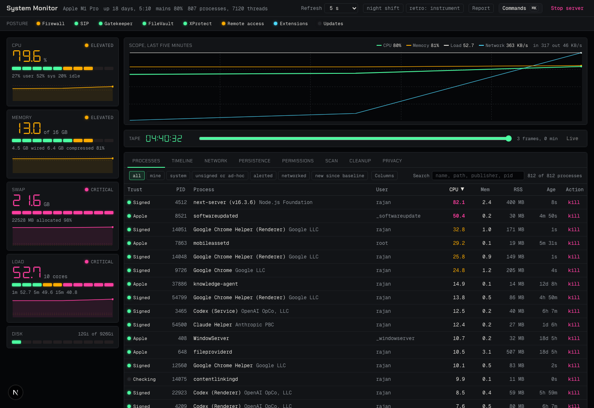

# System Monitor

A security and health monitor for your Mac, as an instrument bench. It shows
what is running and who signed it, what is listening and where connections go,
which apps hold which permissions, what starts at login, and what has changed
since you last looked. It explains every process in plain words. It runs
entirely on your Mac and sends nothing anywhere.



## Install

On an Apple silicon Mac (macOS 13 or later), open Terminal and paste:

```bash
curl -fsSL https://raw.githubusercontent.com/TheSmilemakers/system-monitor/main/scripts/install.sh | bash
```

It builds the app from source on your Mac (about two minutes) and puts
`System Monitor.app` in `~/Applications`. Built where it runs, the app carries
no quarantine flag, so macOS opens it without complaint. Then grant it Full
Disk Access and allow its notifications in System Settings. The full guide,
including a prompt you can hand to an AI coding agent instead, is in
[docs/INSTALL.md](docs/INSTALL.md).

Developers: clone the repository, `bun install`, `bun run dev`, and open
<http://localhost:3000>. Both `bun run dev` and `bun run start` bind
`127.0.0.1`.

**Loopback only, by design.** The app reports on, and can act on, your machine:
running processes, granted permissions, network connections, file deletion. It
binds to `127.0.0.1` and refuses requests whose `Host` is not loopback. Do not
expose it to a network.

## The bench

Vitals on the left, the process workbench on the right, the posture strip and
the scope above. Theme (night shift or daylight) and retro intensity (clean,
instrument, tube) are in the header and remembered per browser.

**Posture.** A row of lamps under the header: firewall, SIP, Gatekeeper,
FileVault, XProtect freshness, remote-access listeners, system extensions
(caution when a third-party kernel extension is loaded) and pending updates.
Press a lamp to read what it means and what to do. Every lamp is a read-only
probe; one that cannot run stays dark rather than green.

**Scope and tape.** The scope draws CPU, memory, load and network throughput
over the last five minutes on one grid, with an alarm tick where a process went
hot. The tape beneath it rewinds the last hour: drag the counter or the scope's
time axis and the scope and process table show that moment; a flick coasts and
settles on a recorded frame. Actions are disabled on the tape; Escape or Back
to live returns.

**Processes.** Every process shows its code-signing trust (Apple, App Store,
signed, ad-hoc, unsigned), publisher and age. Click a name or press Enter to
open the inspector; the Columns menu adds publisher, path, parent and
connection columns; the filters include networked and new since baseline;
Group by app folds each app's helper processes under it. In the table, j and k
move, i inspects, x asks to terminate, / focuses search. ⌘K opens the command
palette; the digits 1 to 8 pick a workbench tab. Every column heading and each
vital carries a hint saying what the figure means.

**The inspector** explains a process from three offline layers, tried in
order: a curated knowledge base of over 500 macOS daemons, agents, developer
tools and third-party apps (`src/data/process-kb.json`: what it is, what is
normal, when to worry, whether it is safe to kill, what to check); Apple's own
manual pages; and heuristics from the path, bundle and signature. It says how
the process was launched: by which launch agent or daemon, by launchd on
demand, or by its parent. Its actions are terminate, suspend, resume, renice,
sample, reveal in Finder, and Watch. Drag its header to the right to dismiss
it, drag its left edge to resize; on a narrow window it is a bottom sheet with
three stops.

**Watch** pins a process by executable path. The monitor then reports in the
timeline, and posts a notification, when that executable starts or stops
(checked once a minute, so a start and stop inside the same minute is missed).

**The monitor** runs while the app is open. Once a minute it snapshots running
executables (by path and signature), outbound destinations, network-bound
listening ports, launch agents and daemons (by content hash), the posture
lamps, user accounts and administrators, the contents of `~/.ssh`, DNS
resolvers, active system extensions, privacy grants, web proxies and
`/etc/hosts`, the crontab and periodic scripts, and third-party kernel
extensions; compares them with the baseline recorded on first run; and writes
what changed to the Timeline tab. Alarms (an unsigned binary from Downloads, a
launch item from an unrecognised vendor, SIP off, a new proxy, a Screen
Recording grant) also post one macOS notification per check. "Mute
notifications" in the palette keeps the monitor quiet while the Timeline still
fills. Destinations fold to their owner, so a content network's rotating
addresses are one subject. "Reset baseline" makes the current state normal. A
baseline from an older build is extended with the surfaces it lacks rather than
treated as empty. State lives in `~/Library/Application Support/system-monitor`
and never leaves the machine.

**The workbench tabs**, digits 1 to 8: Processes, Timeline, Network
(listeners and destinations by owner), Persistence (launch items with their
signers), Permissions (every grant the TCC database records, per app, with a
week of changes; grants it cannot read are said to be unreadable, never
absent), Scan (browsers, Electron apps, bloatware, resource hogs with advice
from the knowledge base, startup items, a health score withheld when a probe
could not run), Cleanup (measured targets, per-item deletion with size and
risk) and Privacy (connections resolved before being matched against a tracker
list, with unresolved addresses reported as unknown rather than clean;
permission grants; unrecognised persistence).

**Report.** `/report` (the Report link in the header) prints a fixed-width
shift report: posture, top processes with trust, listeners and destinations,
and the last 24 hours of timeline events, in 78 columns. Print or save as PDF
from the page, or copy the text; `/api/report` serves it as plain text.

**Mini.** A compact always-on view lives at `/mini` (posture lamps, CPU, memory
and the latest event, sized for a small window):

```bash
open -na "Google Chrome" --args --app=http://127.0.0.1:3000/mini --window-size=440,170
```

## The native shell

`System Monitor.app` is a window of its own around the bench, with the app in
the dock, notifications posted as System Monitor, an alarm count on the dock
badge, and a production server that starts with the app and stops when you
quit. Its Monitor menu mutes notifications and rebuilds the server; View opens
the report or the bench in a browser. The server is rebuilt on launch when the
source is newer than the build.

`scripts/build-shell.sh [path/to/App.app]` compiles `desktop/shell/main.m`
(Objective-C, so the Command Line Tools' clang suffices even when their Swift
toolchain is out of step with the SDK) into an ad-hoc signed, arm64-only
bundle; the default path is `~/Desktop/SystemMonitor.app`. The project it runs
is `SM_PROJECT_DIR`, else the path in
`~/Library/Application Support/system-monitor/project`, else
`~/projects/system-monitor`, else `~/.local/share/system-monitor` (where the
installer puts the source). The server it starts sees `SM_NOTIFIER=app` and
leaves notifications to the shell.

## Accuracy notes

- **CPU percentages come from two sources with different units.** The CPU
  vital shows system-wide usage normalised 0–100% across all cores. The process
  table shows `ps` values, which are a percentage of **one** core and can
  exceed 100%. The table is labelled accordingly.
- **Disk is the Data volume.** Free space is read from `/System/Volumes/Data`,
  where your files live, not the sealed system volume.
- **A score is never a guess.** If a probe times out, is denied, or is
  unsupported, the scan reports `complete: false`, lists what failed, and shows
  no score.
- **Reclaimed space is measured, not estimated.** Cleanup enumerates exactly
  what it will delete, including dotfiles, and reports the bytes actually
  freed.
- **Permissions need Full Disk Access.** Without it the Permissions tab and the
  privacy scan say the grants are unreadable rather than reporting none.

## Requirements

- macOS 13 or later on Apple silicon. Every figure comes from the system's own
  tools: `top`, `vm_stat`, `ps`, `sysctl`, `df`, `lsof`, `netstat`, `pmset`,
  `du`, `find`, `codesign`, `sqlite3`, `kmutil` and friends.
- Bun (the installer fetches it), or Node.js 20.9 or later for development.
- The Command Line Tools, for the native shell.
- Full Disk Access for the app (or your terminal), for the permission audit.

## Development

```bash
bun run check:fast  # typecheck, lint (zero warnings), format check, knip, tests
bun run check       # what CI runs, exactly: check:fast, production dependency
                    # audit (hard fail), build, smoke against next start, the
                    # axe accessibility gate, smoke against next dev, every QA
                    # phase at 10/10

bun run typecheck   # tsc --noEmit, with noUncheckedIndexedAccess
bun run lint        # eslint, zero warnings
bun run test        # bun test
bun run audit:prod  # bun audit --prod --audit-level=high
bun run build       # next build
bun run smoke       # boots the dev server and asserts every route responds
bun run smoke:prod  # same against the production server
bun run a11y        # axe-core in headless Chrome against the built app: the bench
                    # (inspector open too), the mini window and the report, each in
                    # both themes; serious or critical violations fail
bun run qa 0        # QA gate for a phase (0-4)
bun run qa all      # every phase; exits non-zero unless each scores 10/10
```

Tests call the production entry points directly: every route handler, server
action and the sampler run against recorded tool output installed through two
seams, `__setProbeImpl` in `src/lib/probe.ts` and `__setHeadersProvider` in
`src/lib/guard.ts` (see `tests/fixtures.ts`). Coverage is computed on every
run; `bunfig.toml` fails the suite when any loaded file falls below 80% lines
or functions.

`bun run dev` runs `scripts/preflight.mjs` first. It fails in a few
milliseconds, with the reason, when Node is running under Rosetta on an Apple
silicon Mac or the lightningcss binary for this architecture is missing.

A lefthook pre-commit hook (installed by `bun install` through the `prepare`
script) runs Prettier, ESLint and the typecheck on staged files. `bun run
format` rewrites; `bun run knip` reports unused files, exports and
dependencies.

CI (`.github/workflows/ci.yml`) calls `bun run check`, so local green and CI
green mean the same thing. Bun is pinned through `packageManager`; actions are
pinned to commit SHAs; Dependabot opens grouped weekly updates.

Quit the desktop app before `bun run check`: the build step rewrites `.next`
under the server the app is running.

### Troubleshooting: every page returns HTTP 500 on localhost

If the dev server boots but every route is a 500 and the log says
`Cannot find module '../lightningcss.darwin-x64.node'`, Node is running under
Rosetta on an Apple silicon Mac. `bun install` only fetches the native
`lightningcss-darwin-arm64` binary, so an x86_64 Node process cannot load it.
Do not add the x64 binary as a dependency; fix the launch environment instead:

- Check with `node -p process.arch` from the same shell or launcher that starts
  the app. It must print `arm64`.
- A universal Node such as `/usr/local/bin/node` picks the x86_64 slice whenever
  its parent was launched with "Open using Rosetta". Untick that in Finder's
  Get Info for the launcher app, or prefix the command with `arch -arm64`. The
  native shell is arm64-only, so this cannot happen to it.
- Next keeps a per-project dev lock. A broken server left on port 3000 makes
  every other `next dev` here (including `bun run smoke`) exit with code 1
  until it is killed. The smoke script names the PID holding the lock.
- One run under Rosetta poisons the Turbopack dev cache: the failed x64 CSS
  transform is cached, so pages keep returning 500 even after Node runs
  natively. Delete `.next/dev` once and start again.

### Architecture

| Path | Purpose |
|---|---|
| `src/lib/probe.ts` | Async, argv-based system probes with typed outcomes (`ok` / `timeout` / `denied` / `unsupported` / `failed`) |
| `src/lib/sampler.ts` | Server-owned sampling, history window, process naming and alert tracking |
| `src/lib/monitor.ts` | The once-a-minute snapshot, the baseline, the rules that turn a difference into an event |
| `src/lib/posture.ts`, `src/lib/tcc.ts`, `src/lib/persistence.ts` | The posture lamps, the TCC database (user and system scope), launch items |
| `src/lib/destinations.ts` | Folding outbound addresses to their owner |
| `src/lib/explain.ts`, `src/data/process-kb.json` | The three-layer process explainer and its knowledge base |
| `src/lib/cleanup-targets.ts` | The cleanup catalogue and permitted deletion roots |
| `src/lib/guard.ts` | Loopback Host/Origin enforcement, applied per handler |
| `src/lib/scoring.ts` | Health and privacy rubrics, unit-tested against fixtures |
| `src/lib/schemas.ts` | Runtime validation of every API response |
| `src/hooks/use-stream.ts` | The stats transport: a server-sent event stream read with fetch, reconnecting and visibility-aware |
| `src/hooks/use-polling.ts` | Completion-driven polling with abort, overlap and visibility guards, for the slower panels |
| `desktop/shell/main.m` | The native shell |
| `scripts/qa-gate.mjs`, `scripts/a11y.mjs` | Phase-scoped quality gates; the accessibility gate |

| Endpoint | Purpose |
|---|---|
| `GET /api/stream` | CPU, memory, swap, disk, load and processes, pushed as server-sent events at the chosen cadence |
| `GET /api/stats`, `/api/timeline`, `/api/tape` | The same sample on demand; the monitor's events; the last hour of frames |
| `GET /api/scan`, `/api/cleanup`, `/api/privacy` | Health scan, cleanup scan with opaque ids, privacy scan |
| `GET /api/network`, `/api/permissions`, `/api/persistence`, `/api/posture` | The corresponding tabs |
| `GET /api/process`, `/api/explain` | One process in depth; its explanation |
| `GET /api/report` | The shift report as plain text |
| `GET`/`POST /api/settings` | Notification mute, for the shell |
| Server Actions | `killProcess`, `suspendProcess`, `resumeProcess`, `reniceProcess`, `sampleProcess`, `assessProcess`, `revealProcess`, `cleanupItem`, `toggleWatch`, `unwatch`, `setNotifications`, `resetMonitorBaseline`, `stopServer` |

Every route and action calls `assertLocalRequest()` directly. This is
deliberate: the Next.js versions this app has targeted have carried repeated
middleware/proxy bypass advisories, and a routing bypass must not become an
authorisation bypass.

## Security

- No client-supplied string reaches a shell. Deletion uses filesystem APIs
  with containment checks and symlink rejection.
- Loopback binding plus per-handler `Host`/`Origin` enforcement.
- CSP, `frame-ancestors 'none'`, `nosniff`, `no-referrer`, and `no-store` on
  all system JSON.
- Zero high or critical advisories reachable from production dependencies.

The audit and remediation history, including the resolved critical finding, is
in [docs/archive](docs/archive/README.md). Report anything you find via GitHub
issues.

## License

MIT — see [LICENSE](LICENSE).
